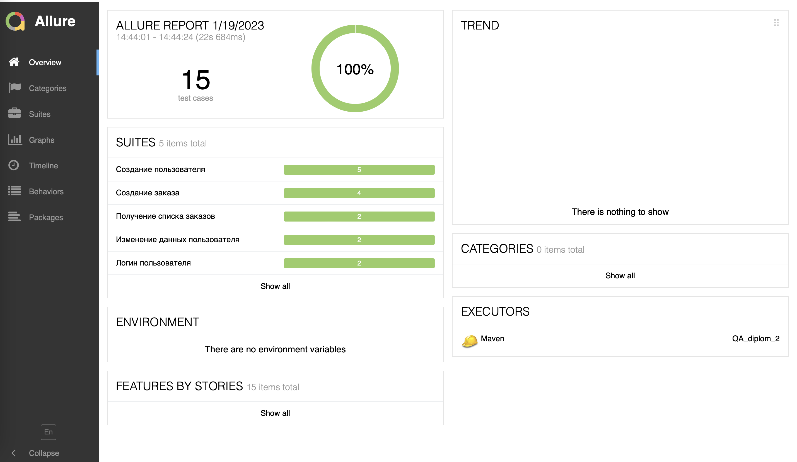

# Проект по автоматизации тестирования API для веб-приложения [Stellar Burgers](https://stellarburgers.nomoreparties.site)

 
 

 
## Покрытый функционал

 > Разработаны автотесты на <code>API</code>.

 ### API

 - [x] +Запросы <code>GET</code>, <code>POST</code>, <code>PATCH</code> и <code>DELETE</code>: 
       1. Создание пользователя:
             + создание уникального пользователя 
             + создание пользователя, который уже зарегистрирован 
             - создание пользователя и не заполнение одно из обязательных полей 
       2. Логин пользователя: 
             - логин под существующим пользователем 
             - логин с неверным логином и паролем 
       3. Изменение данных пользователя: 
             - с авторизацией 
             - без авторизации 
       4. Создание заказа: 
             - с авторизацией 
             - без авторизации 
             - с ингредиентами 
             - без ингредиентов 
             - с неверным хешем ингредиентов 
       5. Получение заказов конкретного пользователя: 
             - авторизованный пользователь 
             - неавторизованный пользователь 
 - [x] +Отображение и соответствие <code>statusCode</code> в ответе запроса
 - [x] +Отображение и соответствие <code>body</code> в ответа запроса
 ## Отчет о результатах тестирования в Allure Report
 ### :dart: Главная страница Allure-отчета
 

 
 

 
